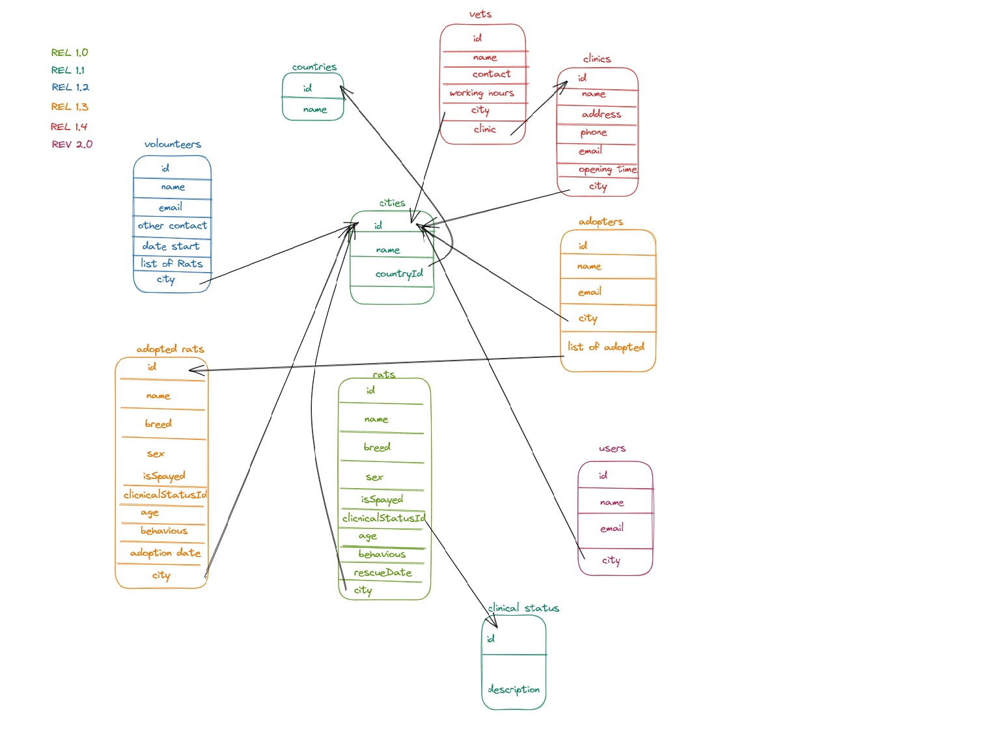

# European Rat Repository

The EER is a web application that aims to help volounteers, vets and adopters to exchange information and keep track of the adoptions. 
Since mid 2010 the "rats as pets" trend has incresed in all Europe, but as for dogs and cats owners started to discard the rats in the woods or in the park since most of
the pet shops donùt care if male and female lives in the same group. This leads to the females to get pregnant and giving birth to 7-12 new rats.
THIS README AS THE PROJECT IS STILL WORKING IN PROGRESS!

##  Table of content
- [User Experience (UX)](#user-experience--ux-)
- [Technologies used](#technologies-used)
- [Features](#features)
- [Testing](#testing)
- [Deployment](#deployment)
- [Credits](#credits)

## User Experience (UX) 

## Technologies used 
### languages
- Java: BE
- Relational DB: H2 embedded DB
- Next.js: FE
- Typescript: FE development tool
- CSS: style
### Frameworks, Libraries & Programs Used
- Spring Boot
- JPA

## Features
### User:
- As anonymous, users can check the news in the landing page, check for the advice about rats pets (environment, food, etc) and contacts the volounteers
- As registered, same as anonymous and can chat with other users and volounteers.
- As adopters, same as registered but can chat with other adopters and have access (read) to the adopted rats and can contact vets directly.
- As Volounteers, same as adopters but have full control over DB (CRUD) and have access to statstic (avg age, mortality, common diseases, etc)

## Development
The project is still in rel1.0, but below are shown the future development
- Rel 1.0 to 1.2 is meant to be used as a tool for recording the rescue of the rats
- Rel 1.3 and 1.4 is meant to integrate information about clinics and vets for helping volounteers and adopters to manage and take care fo the rats
- Rel 2.0 is meant to be a web  application for users to get informations about rats and looking for pets to be adopted.

## Deployment 

## Credits
- On the website of the  [w3schools](https://www.w3schools.com/)
- On the website of the  [Baeldung](https://www.baeldung.com/)
- On School of Applied Technology [/SALT](https://www.salt.study/our-hubs/stockholm) That gave me the chance to learn how to plan and create a web application from scratch.
